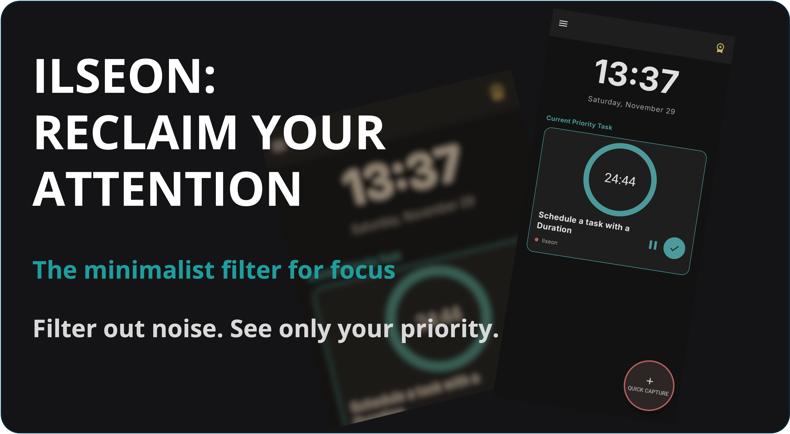
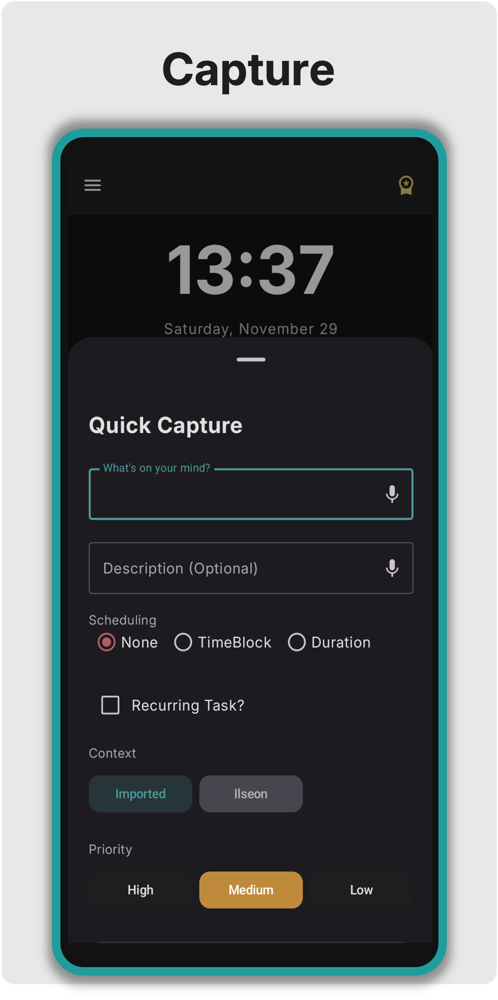
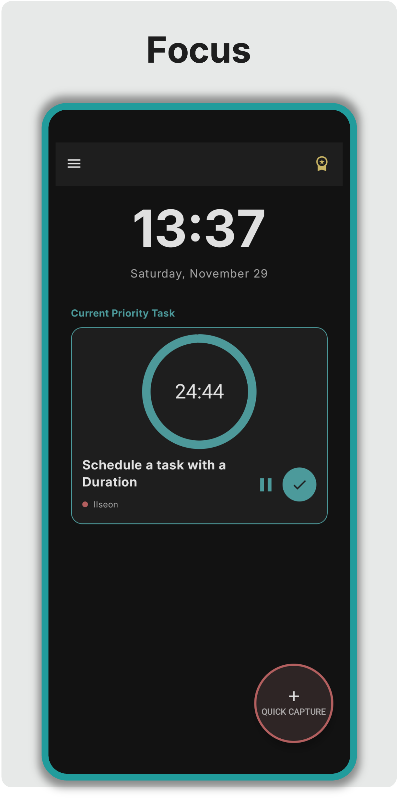
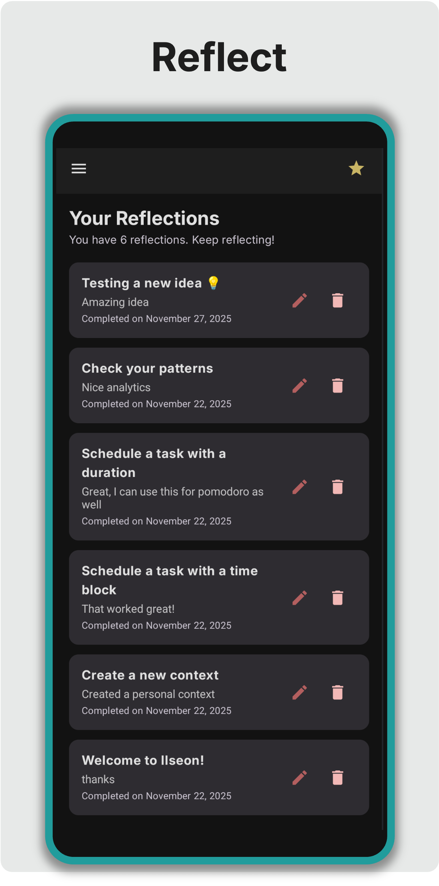
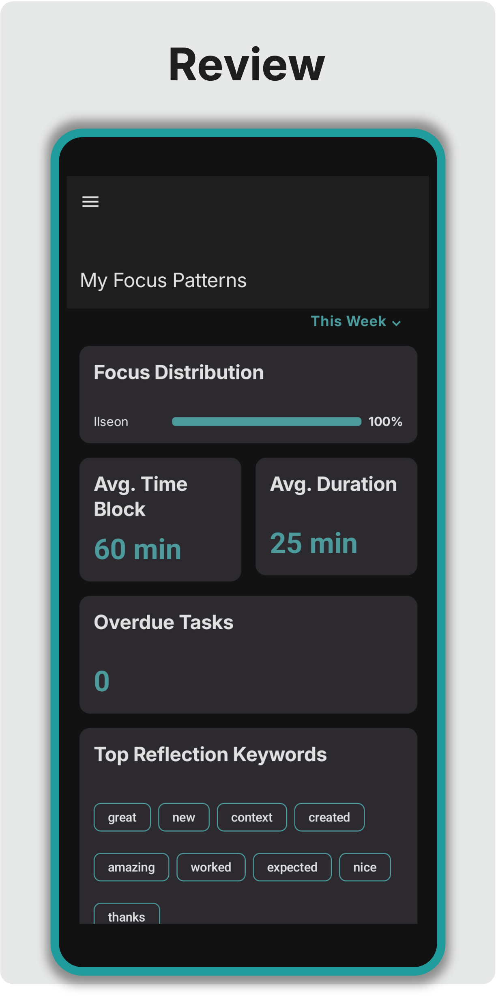

    
    

<h1 align="center">ilseon</h1>

    <strong>A low-friction, distraction-minimal executive function assistant.</strong>

**Ilseon** (일선, Korean for _“front line”_ or _“immediate priority”_) is a minimalist executive function
assistant designed to reduce mental overload. It creates a protected focus environment that helps users
regain control over time, attention, and priorities.

## The Core Problem

Traditional productivity apps assume users can manage endless lists and switch contexts freely.
But for neurodivergent users, this often leads to **context-switching burnout**, **time blindness**, and **task paralysis**.
Ilseon tackles this by **filtering focus**, showing only one Context at a time (e.g. _Work_, _Family_, _Personal_, _Project 1_).
When in a given context, everything else disappears. The goal is to reduce cognitive noise,
so attention stays anchored on what matters _right now_.

## How It Works

* **Context Filtering**: Choose one life context, and all unrelated tasks are hidden.
* **Single Priority View**: The dashboard displays only your current or next task; the one thing that needs your attention.
* **Quick Capture**: A floating action button opens an instant input screen for adding tasks in seconds, helping to externalise thoughts before they become mental clutter.
* **Idea Inbox**: Captures "non-task" mental clutter (fleeting ideas, random thoughts, or things to look up later). These entries can be converted to actionable tasks with a long-press action.
* **Gentle Reminders**: Time-based notifications use vibration and visual cues instead of noisy alerts to respect sensory sensitivity.

## Tech Stack

* **UI Toolkit:** Jetpack Compose
* **Language**: Kotlin
* **Architecture**: MVI (Model-View-Intent)
* **Database**: Room
* **State**: Kotlin Flow / StateFlow
* **Scheduling**: Android AlarmManager

## Design Principles

1.  **Simplicity is Success**: Less is more! Whitespace, quiet colours, and clean typography.
2.  **Focus First**: Only one visible task to combat overwhelm and indecision.
3.  **Low Sensory Load**: Dark, muted themes as default. No flashing elements or visual noise.
4.  **Instant Capture**: The path from “I thought of something” to “It’s safely saved” should take less than two seconds.

## Vision

**Ilseon** is a **cognitive offloading tool** designed for neurodivergent users who need less friction, not more features.
Its purpose is simple: help users reclaim their front line of focus, one context at a time.

## Getting Ilseon

Ilseon is 100% **open source**, built for the community.

| Resource                   | Link                                                                                                                 |
|:---------------------------|:---------------------------------------------------------------------------------------------------------------------|
| **Download App (Android)** | [https://play.google.com/store/apps/details?id=com.ilseon](https://play.google.com/store/apps/details?id=com.ilseon) |
| **Project Homepage**       | [https://cladam.github.io/projects/ilseon/](https://cladam.github.io/projects/ilseon/)                               |

### Screenshots & Preview

|                    Capture                     |                    Focus                     |                    Reflect                    | Review                                         |
|:----------------------------------------------:|:--------------------------------------------:|:---------------------------------------------:|:-----------------------------------------------|
|  |  |  |  |

### Getting started

1. Clone this repository.
2. Open the project in Android Studio
3. Run the project on an emulator or physical device.

### Contributing

Contributions are welcome! Please feel free to open an issue or submit a pull request.